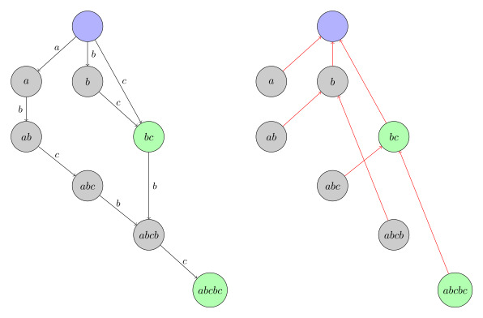

# 字符串

## manacher

```cpp
struct Manacher {
    int n, l, f[maxn * 2], Len;
    char s[maxn * 2];

    void init(char *c) {
        l = strlen(c + 1); s[0] = '~';
        for (int i = 1, j = 2; i <= l; ++i, j += 2)
            s[j] = c[i], s[j - 1] = '#';
        n = 2 * l + 1; s[n] = '#'; s[n + 1] = '\0';
    }
    void manacher() {
        int p = 0, mr = 0;
        for (int i = 1; i <= n; ++i) f[i] = 0;
        for (int i = 1; i <= n; ++i) {
            if (i < mr) f[i] = min(f[2 * p - i], mr - i);
            while (s[i + f[i]] == s[i - f[i]]) ++f[i]; --f[i];
            if (f[i] + i > mr) mr = i + f[i], p = i;
            Len = max(Len, f[i]);
        }
    }

    void solve() {
        for (int i = 1; i <= n; ++i) {
            // [1, l]
            int L = i - f[i] + 1 >> 1, R = i + f[i] - 1 >> 1;
            if (!f[i]) continue;

            // [1, 2 * l + 1]
            L = i - f[i], R = i + f[i];
        }
    }
} M;
```

## SA

$sa_i$ 表示排名为 $i$ 的后缀。

$rnk_i$ 表示 $[i,n]$ 这个后缀的排名（在 SA 里的下标）。

$\mathrm{height}_i$ 是 $sa_i$ 和 $sa_{i - 1}$ 的 LCP 长度。换句话说，向求排名为 $i$ 的后缀和排名为 $i-1$ 的后缀的 LCP 直接就是 $\mathrm{height}_i$；求 $[i,n]$ 这个后缀和它在 sa 里前一个串的 LCP 就是 $\mathrm{height}_{rnk_i}$

```cpp
const int maxn = 1000005;

int sa[maxn], rnk[maxn], tax[maxn], tp[maxn], height[maxn];
void SA(string s) {
	int n = s.size();
    s = '#' + s;
    m = SIGMA_SIZE;
    vector<int> S(n + 1);
    auto RadixSort = [&]() {
		for (int i = 0; i <= m; ++i) tax[i] = 0;
      	for (int i = 1; i <= n; ++i) ++tax[rnk[i]];
      	for (int i = 1; i <= m; ++i) tax[i] += tax[i - 1];
      	for (int i = n; i; --i) sa[tax[rnk[tp[i]]]--] = tp[i];
    };
    for (int i = 1; i <= n; ++i) {
        S[i] = s[i] - '0';
        tp[i] = i;
        rnk[i] = S[i];
    }
    RadixSort();
    for (int len = 1, p = 0; p != n; m = p, len <<= 1) {
        p = 0;
        for (int i = n - len + 1; i <= n; ++i) tp[++p] = i;
        for (int i = 1; i <= n; ++i) if (sa[i] > len) tp[++p] = sa[i] - len;
        RadixSort();
        std::swap(rnk, tp);
        p = 0;
        for (int i = 1; i <= n; ++i)
          rnk[sa[i]] = ((tp[sa[i]] == tp[sa[i-1]]) && (tp[sa[i] + len] == tp[sa[i-1] + len])) ? p : ++p;
    }
    for (int i = 1, p = 0; i <= n; ++i) {
        int pre = sa[rnk[i] - 1];
        if (p) --p;
        while (S[pre + p] == S[i + p]) ++p;
        h[0][rnk[i]] = height[rnk[i]] = p;
    }
    for (int i = 1; i <= 20; ++i) {
		memset(h[i], 0x3f, n * 4 + 4);
		for (int j = 1; j + (1 << i - 1) <= n; ++j)
			h[i][j] = min(h[i - 1][j], h[i - 1][j + (1 << i - 1)]);
	}
}
int Q(int l, int r) {
	if (l > r) swap(l, r);
	++l;
	int k = __lg(r - l + 1);
	return min(h[k][l], h[k][r - (1 << k) + 1]);
}
int lcp(int i, int j) {
	if (i == j) return n - i + 1;
	return Q(rnk[i], rnk[j]);
}
```

## PAM

转移边表示的是在原回文串的两边各加一个字符，得到长度加 2 的新回文串；`fail` 指针则指向该回文串的最长回文后缀。
和其他自动机有所不同，它有两个根节点， 分别代表长度为偶数的串和长度为奇数的串。它们的长度分别为 0 和 -1（注意不是 1，为了添加 2 的长度可以得到长为 1 的回文串），以下分别称为奇根和偶根。
值得注意的是，偶根的fail指针指向的是奇根，而奇根的 `fail` 并不需在意，它的儿子中总会有长为 1 的回文串，因而不可能会失配。


```cpp
struct PAM {
    static constexpr int ALPHABET_SIZE = 28;
    struct Node {
        int len; // 当前节点最长回文长度
        int fail;// 该回文串的最长回文后缀
        int scnt; // 当前节点表示的回文后缀的本质不同回文串个数
        int pcnt; // 当前节点回文串在字符串中出现次数，每个点代表一个不同的回文串
        std::array<int, ALPHABET_SIZE> next; // 转移边
        Node() : len{}, fail{}, scnt{}, next{}, pcnt{} {}
    };
    std::vector<Node> t;
    int last;
    std::string s;
    PAM() {
        init();
    }
    void init() {
        t.assign(2, Node());
        t[1].len = -1;
        last = 0;
        t[0].fail = 1;
        s = "$";
    }
    int newNode() {
        t.emplace_back();
        return t.size() - 1;
    }
    int get_fail(int x) {
        int pos = s.size() - 1;
        while(s[pos - t[x].len - 1] != s[pos]) x = t[x].fail;
        return x;
    }
    void add(char c, char offset = 'a') {
        s += c;
        int let = c - offset;
        int x = get_fail(last);
        if (!t[x].next[let]) {
            int now = newNode();
            t[now].len = t[x].len + 2;
            t[now].fail = t[get_fail(t[x].fail)].next[let];
            t[x].next[let] = now;
            t[now].scnt = t[t[now].fail].scnt + 1;
        }
        last = t[x].next[let];
        t[last].pcnt ++;
    }
};
int main() {
    ios::sync_with_stdio(false);
    cin.tie(0);
    string s;
    cin >> s;
    PAM pam;
    pam.init();
    for(int i = 0;i < s.size();i ++) {
        pam.add(s[i]);
        int ans = pam.t[pam.last].scnt;
        cout << ans << " ";
        if(i + 1 != s.size()) {
            s[i + 1] = (s[i + 1] - 97 + ans) % 26 + 97;
        }
    }
}
```

## SAM

`fa` 为 parent 树上的父亲，`nxt` 为自动机上的指向。



```cpp
struct SAM {
    static constexpr int ALPHABET_SIZE = 26,rt = 1;
    struct Node {
        int len,fa,siz;
        std::array<int, ALPHABET_SIZE> nxt;
        Node() : len{}, fa{}, siz{}, nxt{} {}
    };
    std::vector<Node> t;
    SAM() {
        init();
    }
    void init() {
        t.assign(2, Node());
    }
    int newNode() {
        t.emplace_back();
        return t.size() - 1;
    }
    int getfa(int x){
        return t[x].fa;
    }
    int getlen(int x){
        return t[x].len;//表示该状态能够接受的最长的字符串长度。
    }
    int size(){
        return t.size();
    }
    int extend(int p, int ch) {
        int np = newNode();
        t[np].len = t[p].len + 1;t[np].siz = 1;
        while(p && !t[p].nxt[ch])t[p].nxt[ch] = np,p = t[p].fa;
        if(!p){t[np].fa = rt;return np;}
        int q = t[p].nxt[ch];
        if(t[q].len == t[p].len + 1){
            t[np].fa = q;
        }else {
            int nq = newNode();t[nq].len = t[p].len + 1;t[nq].fa = t[q].fa;
            for(int i = 0;i < 26;i ++)t[nq].nxt[i] = t[q].nxt[i];
            while(p && t[p].nxt[ch] == q)t[p].nxt[ch] = nq,p = t[p].fa;
            t[np].fa = t[q].fa = nq;
        }
        return np;
    }
    int extend_(int p, int ch) {//广义
        if(t[p].nxt[ch]){
            int q = t[p].nxt[ch];
            if(t[q].len == t[p].len + 1)return q;
            int nq = newNode();t[nq].len = t[p].len + 1;t[nq].fa = t[q].fa;
            for(int i = 0;i < 26;i ++)t[nq].nxt[i] = t[q].nxt[i];
            while(p && t[p].nxt[ch] == q)t[p].nxt[ch] = nq,p = t[p].fa;
            t[q].fa = nq;return nq;
        }
        int np = newNode();
        t[np].len = t[p].len + 1;
        while(p && !t[p].nxt[ch])t[p].nxt[ch] = np,p = t[p].fa;
        if(!p){t[np].fa = rt;return np;}
        int q = t[p].nxt[ch];
        if(t[q].len == t[p].len + 1){
            t[np].fa = q;
        }else {
            int nq = newNode();t[nq].len = t[p].len + 1;t[nq].fa = t[q].fa;
            for(int i = 0;i < 26;i ++)t[nq].nxt[i] = t[q].nxt[i];
            while(p && t[p].nxt[ch] == q)t[p].nxt[ch] = nq,p = t[p].fa;
            t[np].fa = t[q].fa = nq;
        }
        return np;
    }
    void build(vector<vector<int>> &e){
        e.resize(t.size());
        for(int i = 2;i < t.size();i ++){
            e[t[i].fa].push_back(i);
        }
    }
};
int main(){
    string s;
    cin >> s;
    int n = s.size();
    SAM sam;
    vector<int> pos(n + 1);
    pos[0] = 1;
    for(int i = 0;i < n;i ++){
        pos[i + 1] = sam.extend(pos[i],s[i] - 'a');
    }
    std::vector<std::vector<int>> e;
    sam.build(e);
    long long ans = 0;
    auto dfs = [&](auto&& self,int x)->void{
        for(auto v:e[x]){
            self(self,v);
            sam.t[x].siz += sam.t[v].siz;
        }
        if(sam.t[x].siz != 1){
            ans = max(ans,1ll * sam.t[x].siz * sam.t[x].len);            
        }   
    };
    dfs(dfs,1);
    cout << ans << "\n";
}
```

1. 本质不同的子串个数

   这个显然就是所有状态所对应的 endpos 集合的大小的和也等价于每个节点的 len 减去parent 树上的父亲的 len

2. 求两个串的最长公共子串

   ```cpp
   int p = 1,len = 0,ans = 0;
   std::vector<int> l(m),L(m);
   for(int i = 0;i < m;i ++){
       int ch = s[i] - 'a';
       if(sam.t[p].nxt[ch]){
           p = sam.t[p].nxt[ch];len ++;
       }else {
           while(p && sam.t[p].nxt[ch] == 0){
               p = sam.t[p].fa;
           }
           if(!p)p = 1,len = 0;
           else len = sam.t[p].len + 1,p = sam.t[p].nxt[ch];
       }//其中p为前缀最长能匹配到的后缀所在的节点
       l[i] = len;
       L[i] = i - len + 1;
   }
   ```

3. 广义 SAM

   ```cpp
   int main(){
       SAM sam;
       int n;
       cin >> n;
       std::vector<std::vector<int>> pos(n);
       for(int i = 0;i < n;i ++){
           string s;
           cin >> s;
           pos[i].resize(s.size() + 1);
           pos[i][0] = 1;
           for(int j = 0;j < s.size();j ++){
               pos[i][j + 1] = sam.extend_(pos[i][j],s[j] - 'a');
           }
       }
       ll ans = 0;
       for(int i = 2;i < sam.t.size();i ++){
           ans += sam.getlen(i) - sam.getlen(sam.getfa(i));
       }
       cout << ans << "\n";
       cout << sam.t.size() - 1 << "\n";
   }
   ```

parent 树上每个节点维护了一个区间，若 p 是 q 的父节点则有 maxp = minq - 1

每个节点的 endpos 集合为该节点 parent 树上的子树 siz 大小

**反串的 SAM 的 parent 树是原串的后缀树**

## ACAM

AC 自动机的失配指针指向所有模式串的前缀中匹配当前状态的最长后缀。

`fail` 树上 $u$ 和 $v$ 的 $lca$ 为 $u$ 和 $v$ 的最长公共border。

```cpp
const int maxn = 2e5 + 7;
#define ch s[i] - 'a'
struct AC_automaton {
    int nxt[26], cnt, fail;
} T[maxn]; 
int tot = 1, rt = 1, id[maxn];
void insert(string &s, int k) {
    int now = rt, l = s.size();
    for (int i = 0; i < l; ++i) {
        if (!T[now].nxt[ch]) T[now].nxt[ch] = ++tot;
        now = T[now].nxt[ch];
    } id[k] = now;
}
void init_fail() { // Trie 图
    queue<int> q;
    for (int i = 0; i < 26; ++i) {
        int &u = T[rt].nxt[i];
        if (!u) { u = rt; continue; }
        T[u].fail = rt; q.push(u); 
    }
    while (!q.empty()) {
        int u = q.front(); q.pop(); 
        for (int i = 0; i < 26; ++i) {
            int &v = T[u].nxt[i];
            if (!v) { v = T[T[u].fail].nxt[i]; continue; }
            T[v].fail = T[T[u].fail].nxt[i]; q.push(v);
        }
    }
}
int siz[maxn];
int main() {
    ios::sync_with_stdio(false);
    cin.tie(0);
    int n;
    cin >> n;
    for(int i = 0;i < n;i ++) {
        string t;
        cin >> t;
        insert(t,i);
    }
    init_fail();
    string s;
    cin >> s;
    for(int u = rt,i = 0;i < s.size();i ++) {
        u = T[u].nxt[ch];
        ++ siz[u];
    }
    vector<vector<int>> e(tot + 1);
    for(int i = 2;i <= tot;i ++) e[T[i].fail].push_back(i);
    auto dfs = [&](auto self,int x) -> void  {
        for(auto v : e[x]) {
            self(self,v);
            siz[x] += siz[v];
        }
    };
    dfs(dfs,1);
    for(int i = 0;i < n;i ++)  cout << siz[id[i]] << "\n";
}
```

## KMP

```cpp
struct KMP{
    string s2;// add '#'
    std::vector<int> nxt;
    int m;
    KMP(string y) :s2(y){
        m = s2.size() - 1;
        nxt.resize(m + 1,0);
        for(int i = 2,p = 0;i <= m;i ++){
            while(p && s2[i] != s2[p + 1])p = nxt[p];
            if(s2[i] == s2[p + 1])p ++;
            nxt[i] = p;
        }
    }
    void match(string s1){
        int n = s1.size() - 1;
        for(int i = 1,p = 0;i <= n;i ++){
            while(p && s1[i] != s2[p + 1])p = nxt[p];
            if(s1[i] == s2[p + 1]){
                p ++;
                if(p == m){
                    //cout<<i - m + 1<<endl;
                    p = nxt[p];
                }
            }
        }
    }
    std::vector<int> find_border(){
        std::vector<int> v;
        for(int i = nxt[m];i;i = nxt[i])v.push_back(i);
        return v;
    }// 找该串所有的周期
    std::vector<int> calc_prefixes(){
        std::vector<int> cnt(m + 1,1);
        for(int i = m;i >= 1;i --)cnt[nxt[i]] += cnt[i];
        return cnt;
    }// 每个前缀出现次数
};
```

## KMP 自动机

```cpp
for(int i = 1, fail = 0; i <= n; i ++) {
	fail = nxt[fail][s[i]]; // 注意这一行不能和下一行互换
	nxt[i - 1][s[i]] = i;
	for(int j = 0; j < m; j ++)
		nxt[i][j] = nxt[fail][j];
}
```

## Z函数

对于一个长度为 $n$ 字符串 $s$，定义函数 $z[i]$ 表示和 $s[i,n-1]$（即以 $s[i]$ 开头的后缀）的最长公共前缀（LCP）的长度，特别地，$z[0] = 0$。

```cpp
std::vector<int> getZ(const std::string &s) {
  int n = s.size();
  std::vector<int> Z(n);
  Z[0] = n;
  for (int i = 1, l = 0, r = 0; i < n; ++i) {
    if (i <= r && Z[i - l] < r - i + 1) {
      Z[i] = Z[i - l];
    } else {
      Z[i] = std::max(0, r - i + 1);
      while (i + Z[i] < n && s[Z[i]] == s[i + Z[i]]) ++Z[i];
    }
    if (i + Z[i] - 1 > r) r = i + Z[l = i] - 1;
  }
  return Z;
}

std::vector<int> match(const std::string &s, const std::string &t) {
  auto Z = getZ(t);
  int n = s.size(), m = t.size();
  std::vector<int> ret(n);
  while (ret[0] < n && ret[0] < m && s[ret[0]] == t[ret[0]]) ++ret[0];
  for (int l = 0, r = ret[0] - 1, i = 1; i < n; ++i) {
    if (i <= r && Z[i - l] < r - i + 1) {
      ret[i] = Z[i - l];
    } else {
      ret[i] = std::max(0, r - i + 1);
      while (i + ret[i] < n && s[i + ret[i]] == t[ret[i]]) ++ret[i];
    }
    if (i + ret[i] - 1 > r) r = i + ret[l = i] - 1;
  }
  return ret;
}
```

## LCP

```cpp
for(int i = n;i >= 1;i --) {
	for(int j = n;j >= 1;j --) {
		if(s[i] == s[j]) {
			f[i][j] = f[i + 1][j + 1] + 1;// i-n和j-n的lcp
		}
	}
}
```

## Hash

```cpp
struct Hash {
	string s;
	using ull = unsigned long long;
	ull P1 = 998255347;
	ull P2 = 1018253347;
	ull base = 131;
	vector<ull> hs1,hs2;
	vector<ull> ps1,ps2;
	Hash(string s): s(s) {
		int n = s.size();
		hs1.resize(n);
		hs2.resize(n);
		ps1.resize(n);
		ps2.resize(n);
		ps1[0] = ps2[0] = 1;
		hs1[0] = hs2[0] = (s[0] - 'a' + 1);
		for(int i = 1;i < n;i ++) {
			hs1[i] = hs1[i - 1] * base % P1 + (s[i] - 'a' + 1);
			hs2[i] = hs2[i - 1] * base % P2 + (s[i] - 'a' + 1);
			ps1[i] = (ps1[i - 1] * base) % P1;
			ps2[i] = (ps2[i - 1] * base) % P2;
		}
	}
	pair<ull,ull> query(int l,int r) {
		ull res1 = (hs1[r] - (l == 0 ? 0 : hs1[l - 1]) * ps1[r - l + 1] % P1 + P1) % P1;
		ull res2 = (hs2[r] - (l == 0 ? 0 : hs2[l - 1]) * ps2[r - l + 1] % P2 + P2) % P2;
		return {res1,res2};
	} // [l,r]
};
```
